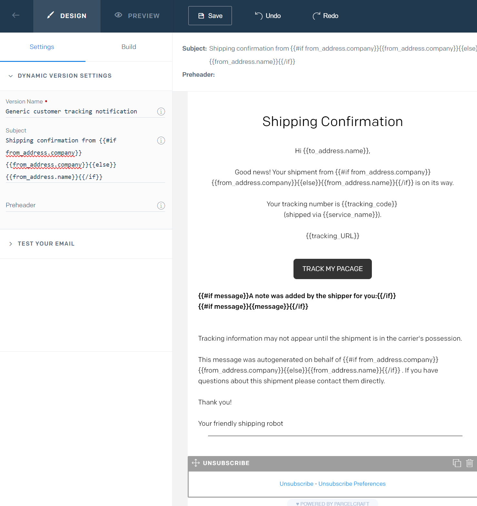
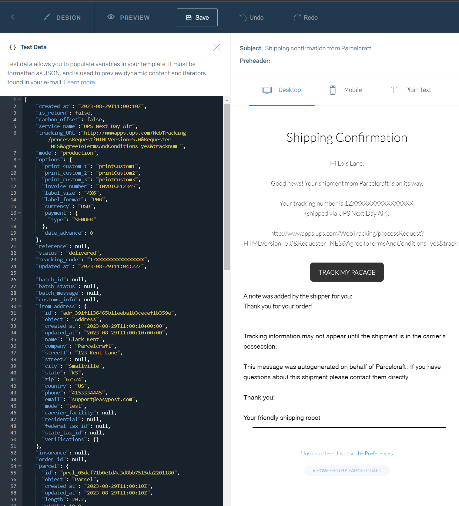

# Custom Email Notifications

You can let Parcelcraft send your customers a generic email with tracking information or use your own SendGrid account to customize your email templates for customer email notifications.

## Copy SendGrid API Key to Parcelcraft
1. Sign up for Sendgrid at https://sendgrid.com/
2. Navigate to the [SendGrid API page](https://app.sendgrid.com/settings/api_keys) to see your list of API keys. 
3. If you haven't saved your SendGrid API Key, create a new key and ensure it is a Full Access Key or has access to Design Library, Address Allow List, BCC, Suppressions, Unsubscribe Groups and full access to Email Testing, Mail Send. Copy the API key into a document to make sure you have copied it correctly.
4. Go to the [Parcelcraft Settings page](https://dashboard.stripe.com/settings/apps/com.productivity.parcelcraft), select the **Notifications** tab and select the **Custom email template with SendGrid** radio button.
5. Paste the SendGrid API key into the **SendGrid API Key** entry box.

## Configure SendGrid

In SendGrid, add add a verified Sender, unsubscribe groups and create a dynamic template for a customer Shipping Notification, Canceled Shipment notification, and a return shipment notification
1.  [Add a verified Sender](https://docs.sendgrid.com/ui/sending-email/sender-verification#adding-a-sender "Adding a Sender")
2. [Create an Unsubscribe Group](https://docs.sendgrid.com/ui/sending-email/create-and-manage-unsubscribe-groups#create-an-unsubscribe-group "Create an Unsubscribe Group")
3. [Create a dynamic template](https://sendgrid.com/en-us/blog/how-to-use-sendgrids-dynamic-templates-for-your-transactional-emails "Create a dynamic template")


## SendGrid dynamic email templates


SendGrid allows you to use a special variables in your emails using handlebars.  Variables are encased in brackets like `{{my_variable}}`. Read about how to use [handlebar variables](https://docs.sendgrid.com/for-developers/sending-email/using-handlebars) in your Dynamic Email templates.


##### Compose a SendGrid dynamic template




### Customer tracking notification sample template


##### Subject Line

``` hbs
Shipping confirmation from {{#if from_address.company}}{{from_address.company}}{{else}}{{from_address.name}}{{/if}}
```


##### Body

```hbs

Hi {{to_address.name}},

Good news! Your shipment from 
{{#if from_address.company}}{{from_address.company}}{{else}}{{from_address.name}}{{/if}} 
is on its way.

Your tracking number is {{tracking_code}} 
(shipped via {{service_name}}).

{{tracking_URL}}

{{#if message}}A note was added by the shipper for you:{{/if}}
{{#if message}}{{message}}{{/if}}


Tracking information may not appear until the shipment is in the carrier's possession.

This message was autogenerated on behalf of 
{{#if from_address.company}}{{from_address.company}}{{else}}{{from_address.name}}{{/if}}. 
If you have questions about this shipment please contact them directly.

Thank you!

Your friendly shipping robot

```


### Test data

You can test your variables in your SendGrid Preview by using this test data. All email notifications will recieve a similar payload to this. In SendGrid on your Template view, click 'Preview' and enter this test data:

##### Test data

```JSON
{
    "created_at": "2023-08-29T11:00:10Z",
    "is_return": false,
    "carbon_offset": false,
    "service_name":"UPS Next Day Air",
    "tracking_URL":"http://wwwapps.ups.com/WebTracking/processRequest?HTMLVersion=5.0&Requester=NES&AgreeToTermsAndConditions=yes&tracknum=",
    "mode": "production",
    "options": {
      "print_custom_1": "printCustom1",
      "print_custom_2": "printCustom2",
      "print_custom_3": "printCustom3",
      "invoice_number": "INVOICE12345",
      "label_size": "4X6",
      "label_format": "PNG",
      "currency": "USD",
      "payment": {
        "type": "SENDER"
      },
      "date_advance": 0
    },
    "reference": null,
    "status": "delivered",
    "tracking_code": "1ZXXXXXXXXXXXXXXXX",
    "updated_at": "2023-08-29T11:04:22Z",
    
    "batch_id": null,
    "batch_status": null,
    "batch_message": null,
    "customs_info": null,
    "from_address": {
      "id": "adr_391f1136465b11eeba1b3cecef1b359e",
      "object": "Address",
      "created_at": "2023-08-29T11:00:10+00:00",
      "updated_at": "2023-08-29T11:00:10+00:00",
      "name": "Clark Kent",
      "company": "Parcelcraft",
      "street1": "123 Kent Lane",
      "street2": null,
      "city": "Smallville",
      "state": "KS",
      "zip": "67524",
      "country": "US",
      "phone": "4153334445",
      "email": "support@easypost.com",
      "mode": "test",
      "carrier_facility": null,
      "residential": null,
      "federal_tax_id": null,
      "state_tax_id": null,
      "verifications": {}
    },
    "insurance": null,
    "order_id": null,
    "parcel": {
      "id": "prcl_05dcf71b0e1d4c3d8bb7515da2201180",
      "object": "Parcel",
      "created_at": "2023-08-29T11:00:10Z",
      "updated_at": "2023-08-29T11:00:10Z",
      "length": 20.2,
      "width": 10.9,
      "height": 5,
      "predefined_package": null,
      "weight": 3.9,
      "mode": "test"
    },
    "postage_label": {
      "object": "PostageLabel",
      "id": "pl_d9c28bb80d334cdab9c61e83c6a81fac",
      "created_at": "2023-08-29T11:00:12Z",
      "updated_at": "2023-08-29T11:00:13Z",
      "date_advance": 0,
      "integrated_form": "none",
      "label_date": "2023-08-29T11:00:12Z",
      "label_resolution": 200,
      "label_size": "4x7",
      "label_type": "default",
      "label_file_type": "image/png",
      "label_url": "https://easypost-files.s3.us-west-2.amazonaws.com/files/postage_label/20230829/e8f4c805339eaf4e4598f10da10fa0a064.png",
      "label_pdf_url": null,
      "label_zpl_url": null,
      "label_epl2_url": null,
      "label_file": null
    },
    "message": "Thank you for your order!",
    "refund_status": null,
    "scan_form": null,
    "selected_rate": {
      "id": "rate_f170b1e31d9b4831b5bb250bd235155b",
      "object": "Rate",
      "created_at": "2023-08-29T11:00:12Z",
      "updated_at": "2023-08-29T11:00:12Z",
      "mode": "test",
      "service": "NextDayAir",
      "carrier": "UPSDAP",
      "rate": "50.85",
      "currency": "USD",
      "retail_rate": "130.61",
      "retail_currency": "USD",
      "list_rate": "138.71",
      "list_currency": "USD",
      "billing_type": "easypost",
      "delivery_days": 1,
      "delivery_date": null,
      "delivery_date_guaranteed": true,
      "est_delivery_days": 1,
      "shipment_id": "shp_d0c2d25409af42d982adc7f2a87e3209",
      "carrier_account_id": "ca_35354e128d45462ea1ead3246d558458"
    },
    "to_address": {
      "id": "adr_391c36bd465b11eea97fac1f6bc539ae",
      "object": "Address",
      "created_at": "2023-08-29T11:00:10+00:00",
      "updated_at": "2023-08-29T11:00:10+00:00",
      "name": "Lois Lane",
      "company": null,
      "street1": "456 Daily Planet Avenue",
      "street2": null,
      "city": "Metropolis",
      "state": "IL",
      "zip": "62960",
      "country": "US",
      "phone": "8573875756",
      "email": "dr_steve_brule@gmail.com",
      "mode": "test",
      "carrier_facility": null,
      "residential": null,
      "federal_tax_id": null,
      "state_tax_id": null,
      "verifications": {}
    },
    "forms": [],
    "fees": [
      {
        "object": "Fee",
        "type": "LabelFee",
        "amount": "0.01000",
        "charged": true,
        "refunded": false
      },
      {
        "object": "Fee",
        "type": "PostageFee",
        "amount": "50.85000",
        "charged": true,
        "refunded": false
      }
    ],
    "id": "shp_d0c2d25409af42d982adc7f2a87e3209",
    "object": "Shipment"
  }
```


For example:




Now that you've created and tested your Customer Notification email, select that template in your ParcelCraft settings.


