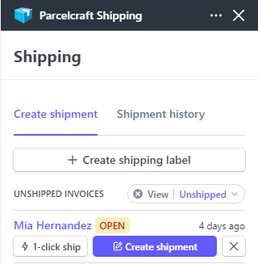

# 1-Click Shipping

 

Once you have configured all the settings necessary for 1-Click Shipping the **1-click ship** button will be enabled. If you hover your mouse over the button, you will see all the information that will be used to create the shipping label. If you need to change anything, simply click on the **Create shipment** button to edit the label attributes.

When you click the **1-click ship** button the label is automatically printed. If you have a digital scale attached, it is used to get the weight of the package before printing the label.

The following pages in this section guides you through the necessary settings and defaults you need to configure to take advantage of this powerful feature.

## Recommended tools for 1-click shipping

- A [digital scale](https://www.printnode.com/en/docs/supported-scales) with a USB or serial port
- A 4x6 inch (102x152mm) [**Thermal label printer**](https://www.amazon.com/4x6-thermal-label-printer/s?k=4x6+thermal+label+printer) that supports printing from a roll of labels
- A [**PrintNode**](https://www.printnode.com/) account

