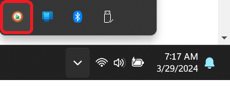
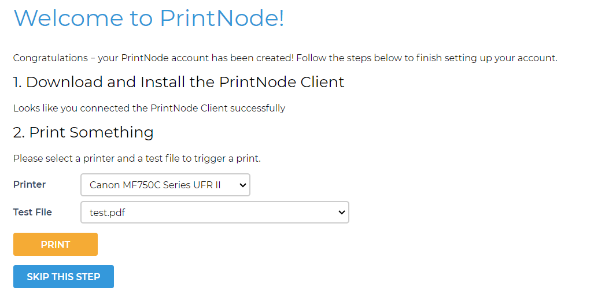

# Setup PrintNode Account

PrintNode is a cloud printing service that allows you to connect your printers to the internet and manage printing from anywhere. Parcelcraft integrates with PrintNode to enable automatic printing of shipping labels and forms directly to your connected printers. Follow the steps below to set up your PrintNode account.

## Step 1: Create or Log In to Your PrintNode Account

- If you don't have a PrintNode account, [sign up for one here](https://api.printnode.com/app/login/register). The free plan allows up to 50 prints a month.
- If you already have an account, [log in to PrintNode](https://api.printnode.com/app/login).

> **Note:** PrintNode offers a 30-day trial with unlimited printing. After the trial period, you can continue using the free "Lite" plan or upgrade to a paid plan based on your printing needs.

## Step 2: Install PrintNode Client

1. Download and install the PrintNode Client from the [downloads page](https://api.printnode.com/app/downloads).
2. Once installed, the PrintNode Client will run in the background and appear as an icon in your Windows system tray.

> **Tip:** Make sure the PrintNode Client is running whenever you want to use automatic printing with Parcelcraft.

## Step 3: Configure PrintNode

1. While the PrintNode Client is running, go to the [PrintNode Welcome page](https://api.printnode.com/app/welcome) to verify the client installation.
2. On the Welcome page, you should see all your local printers automatically listed in the Printer combo box.

3. Select a printer from the list and click on the "Print Test Page" button to ensure that PrintNode is properly connected to your printer.

> **Note:** If you want to continue using the free "Lite" plan after the 30-day PrintNode trial, make sure to select "Lite" before proceeding.

## Step 4: Obtain Your PrintNode API Key

1. Log in to your PrintNode account and click on the [API Keys link](https://api.printnode.com/app/apikeys) at the top of the page.
2. Enter your PrintNode password when prompted.
3. Select and copy your API key to your clipboard. If you don't have one, enter an API key description and click the **Create** button.

> **Note:** Make sure to keep your API key secure and do not share it with anyone, as it grants access to your PrintNode account.

## Step 5: Enter Your PrintNode API Key in Parcelcraft

1. Go to the [Parcelcraft Settings page](https://dashboard.stripe.com/settings/apps/com.productivity.parcelcraft).
2. Click on the "Printers & digital scale" tab.
3. Locate the "Use PrintNode to send label files directly to my printer" option and toggle it on.

4. Paste the API key you copied from PrintNode into the provided box.

## Step 6: Configure Your Printer Settings

1. After entering your PrintNode API key, you will see a list of available printers associated with your PrintNode account.

2. Select a printer for printing shipping labels and another printer for printing forms (if applicable).
3. Adjust the related settings, such as label size and orientation, to match your printer's requirements.

## Step 7: Test Your Printer Setup

1. Click on the "Print Test label" and "Print test form" buttons to ensure that your printers are properly connected and configured.
2. Verify that the test pages are printed correctly on the selected printers.

Congratulations! You have now successfully connected your PrintNode account to Parcelcraft. This integration allows you to seamlessly manage your printers and automate the printing process for shipping labels and forms.

> **Tip:** If you want to further automate your shipping workflow, consider [linking a digital scale](/additional-automation/setup-a-digital-scale) to your Parcelcraft account. This will enable automatic weight capture and streamline the label creation process even more.

> **Tip:** If you encounter any issues during the PrintNode setup process or have questions about the integration with Parcelcraft, don't hesitate to reach out to our support team at [support@parcelcraft.com](mailto:support@parcelcraft.com) for assistance.
