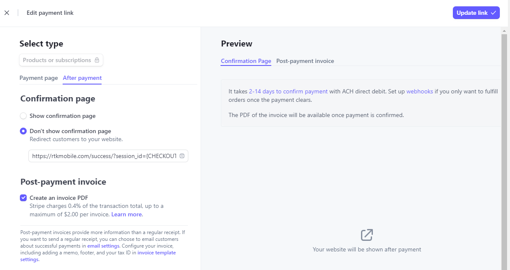

# Setup Stripe Invoicing

Parcelcraft gets the information about an order and what products to ship from the Stripe invoice. Creating an invoice is an optional setting in Stripe that is necessary for Parcelcraft to automatically create a list of unshipped orders. You can still use Parcelcraft to create shipping labels if invoicing is turned off but 1-Click Shipping will not be available.

To enable invoices for Stripe payment links, [click here](https://dashboard.stripe.com/payment-links) to see them or on the Stripe dashboard, click "More +" and "Payment links"


For each of the active Payment links that you want to automate shipping for, click the ... button by each Payment link and click "Edit" and turn on "Create an invoice PDF" in the Post-payment invoice section.



If you are using the Stripe API for Checkout Sessions, set invoice_creation.enabled to true as described at [this link](https://docs.stripe.com/api/checkout/sessions/object#checkout_session_object-invoice_creation-enabled).

____________________________
Here's an improved version of the MDX help page:

# Setup Stripe Invoicing

Parcelcraft relies on the information from Stripe invoices to determine the order details and the products to ship. Creating an invoice is an optional setting in Stripe, but it is necessary for Parcelcraft to automatically generate a list of unshipped orders. While you can still use Parcelcraft to create shipping labels without invoicing enabled, 1-Click Shipping will not be available.

## Enabling Invoices for Stripe Payment Links

To enable invoices for Stripe payment links, follow these steps:

1. Go to the [Stripe Payment Links](https://dashboard.stripe.com/payment-links) page or click on "More +" and then "Payment links" on the Stripe dashboard.


2. For each active Payment link that you want to automate shipping for, click the "..." button next to the Payment link and select "Edit".

3. Click the "After payment" tab.

4. In the "Post-payment invoice" section, turn on the "Create an invoice PDF" option.


4. Save the changes to the Payment link by clicking the "Update link" button.

By enabling invoice creation for your Payment links, Parcelcraft will be able to access the necessary order information to automate the shipping process.

## Enabling Invoices for Stripe Checkout Sessions

If you are using the Stripe API for Checkout Sessions, you need to set the `invoice_creation.enabled` parameter to `true` when creating the Checkout Session. Here's an example:

```javascript
const session = await stripe.checkout.sessions.create({
  payment_method_types: ['card'],
  line_items: [
    {
      price_data: {
        currency: 'usd',
        product_data: {
          name: 'T-shirt',
        },
        unit_amount: 2000,
      },
      quantity: 1,
    },
  ],
  mode: 'payment',
  success_url: 'https://example.com/success',
  cancel_url: 'https://example.com/cancel',
  invoice_creation: {
    enabled: true,
  },
});
```

For more information on enabling invoices for Checkout Sessions, refer to the [Stripe API documentation](https://docs.stripe.com/api/checkout/sessions/object#checkout_session_object-invoice_creation-enabled).

> **Note:** Enabling invoices for Stripe Payment Links or Checkout Sessions is crucial for Parcelcraft to automate the shipping process and provide 1-Click Shipping functionality.

If you have any further questions or need assistance with setting up Stripe invoicing for Parcelcraft, please don't hesitate to reach out to our support team at [support@parcelcraft.com](mailto:support@parcelcraft.com).