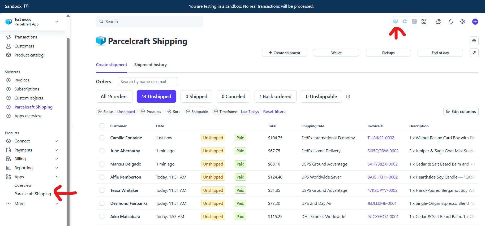
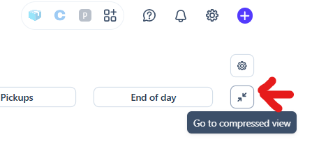

# The full-page app

Parcelcraft runs in two places inside the Stripe dashboard:

- **The full-page app** — a dedicated page with a unified Orders list, a
  Shipment history tab, bulk shipping, and quick access to your wallet,
  pickups, and end-of-day forms.
- **The drawer** — the compact side panel that opens on top of whatever
  dashboard page you're viewing.

Both surfaces offer identical functionality, so use whichever fits the moment:
the drawer is handy while you're looking at a specific payment or invoice,
while the full page gives you more room to work through many orders at once.
The one exception is [1-click shipping](/enable-1-click-shipping), which is
only available in the drawer due to a Stripe SDK limitation —
[bulk shipping](/full-page-app/bulk-shipping) in the full-page app is the
high-volume equivalent.

## Open the full-page app

There are two entry points in the Stripe dashboard:

1. **Full page:** in the left sidebar, click **Apps**, then **Parcelcraft
   Shipping**. Once you've used it, Stripe also lists it under **Shortcuts**
   at the top of the sidebar for one-click access.
2. **Drawer:** click the Parcelcraft icon in the app tray at the top right of
   the dashboard.

Or jump straight there with these links:

- Open the [full-page app](https://dashboard.stripe.com/app/com.productivity.parcelcraft)
- Open the [drawer](https://dashboard.stripe.com/dashboard/?open_drawer_app=com.productivity.parcelcraft)
  — where you can [1-click ship](/enable-1-click-shipping) items

## Switch between the full page and the drawer

You can move between the two surfaces at any time:

- In the drawer, click **Expand to full page view** to jump to the full-page
  app.
- In the full-page app, click the compress button at the top right of the page
  to return to the drawer.

## What's on the page

The full-page app has two tabs:

- **Create shipment** — the unified [Orders list](/full-page-app/orders-list),
  built from your payments and invoices, where you create one or many
  shipments.
- **Shipment history** — every shipment you've created, including test labels
  and shipments that didn't start from an order.

Above the tabs, a row of buttons gives you quick access to common tasks:

| Button | What it does |
| --- | --- |
| **+ Create shipment** | Start a [blank shipment](/full-page-app/create-shipment) that isn't tied to a payment or invoice |
| **Wallet** | View and add funds to your [EasyPost balance](/full-page-app/wallet) |
| **Pickups** | Schedule a [carrier driver pickup](/full-page-app/pickups) for your packages |
| **End of day** | Create an [end-of-day scan form](/full-page-app/end-of-day) (shipping manifest) for carrier pickup |
