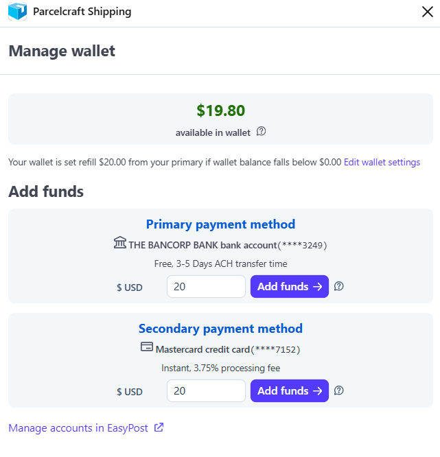

# Wallet

Postage is paid from your EasyPost wallet: when you buy a label, its cost
comes out of your wallet balance, so keep enough funds in it to cover your
shipping. Click **Wallet** at the top of the
[full-page app](/full-page-app), or in the drawer's footer menu, to open
**Manage wallet**:

> We recommend keeping about a week's worth of your average shipping costs
> in the wallet, so free ACH transfers have time to clear before the
> balance runs out.

## Add funds

Funds come from the payment methods on your EasyPost account — a primary
and an optional secondary. The two kinds of payment method behave
differently:

| Payment method | Speed | Fee |
| --- | --- | --- |
| Bank account (ACH) | 3–5 days | Free |
| Credit card | Instant | 3.75% processing fee |

Enter an amount next to the payment method ($20.00 minimum), click
**Add funds**, and confirm.

Payment methods themselves are managed in EasyPost, not in Parcelcraft.
Click **Manage accounts in EasyPost** at the bottom of the view to add or
change them.

## Auto-refill

The sentence under your balance shows your current auto-refill rule — for
example, refill $20.00 from your primary payment method when the balance
falls below $0.00. Click **Edit wallet settings** to change it:

- **Auto reload amount** — how much to add from your primary and,
  optionally, your secondary payment method when a refill triggers.
- **Trigger when balance is below** — the balance that triggers a refill.
  Set the trigger to $0 if you don't want automatic refills.

Click **Confirm** to save.

> The wallet requires a production EasyPost API key. Test labels don't
> cost postage, so no funds are needed while you experiment in Stripe test
> mode.
