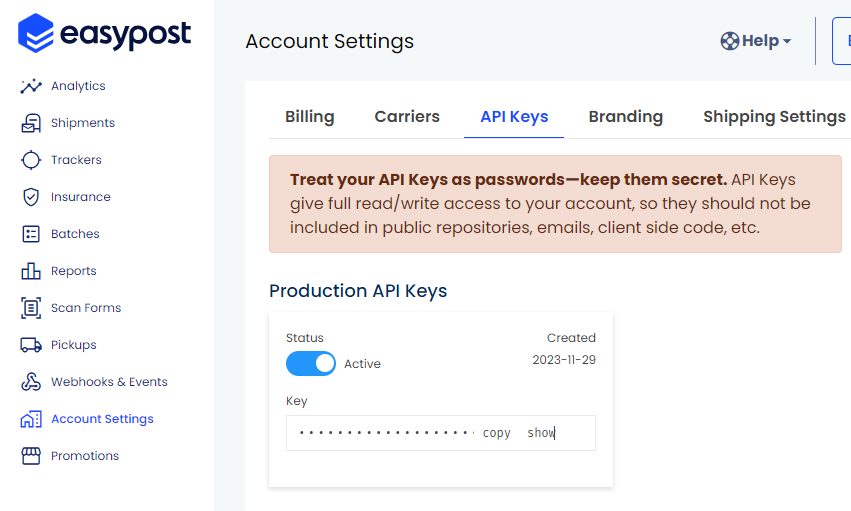
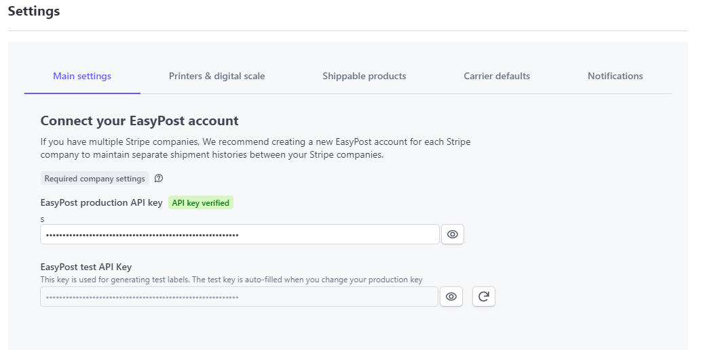

# Connecting Your EasyPost Account to Parcelcraft

After creating your EasyPost account, you can easily connect it to your Parcelcraft account to start managing your shipments. Follow these simple steps to establish the connection:

## Step 1: Obtain Your EasyPost Production API Key

1. Log in to your EasyPost account and navigate to the [API Keys tab on the Account Settings page](https://www.easypost.com/account/settings?tab=api-keys).
2. In the Production API Keys box, click on the "Copy" button to copy your API key to your clipboard.

## Step 2: Enter Your EasyPost API Key in Parcelcraft

1. Log in to your Parcelcraft account and go to the Settings page.
2. On the "Main settings" tab, locate the EasyPost production API key field.
3. Paste the API key you copied from EasyPost into the provided box.

## Step 3: Save Your Changes

1. After entering your EasyPost API key in Parcelcraft, click on the "Save changes" button to store the information securely.

That's it! You have now successfully connected your EasyPost account to Parcelcraft. This integration allows you to seamlessly manage your shipments, access multiple carriers, and generate shipping labels directly from your Parcelcraft account.
