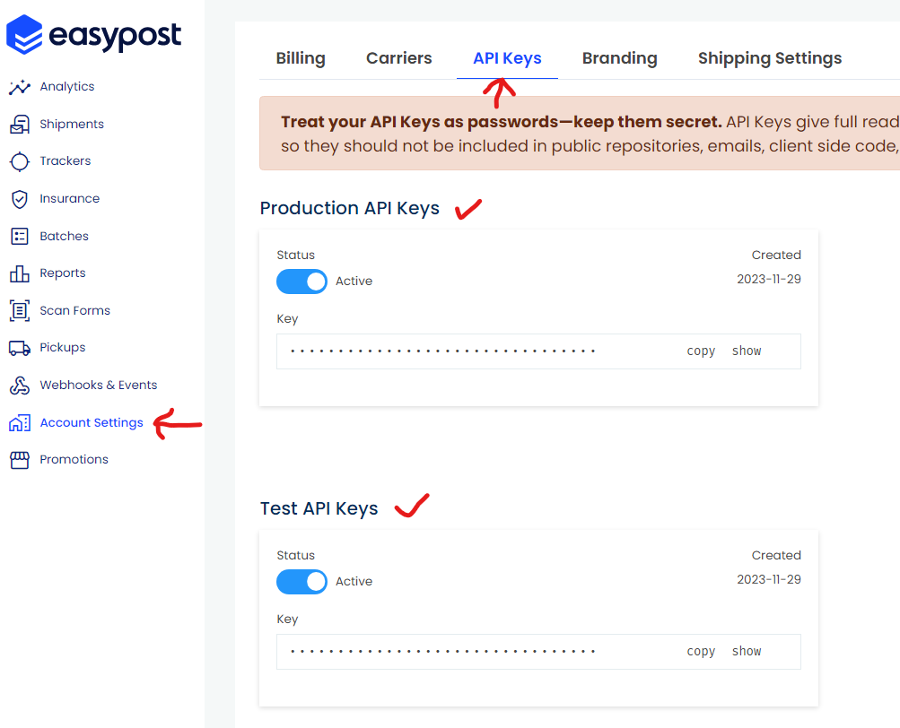
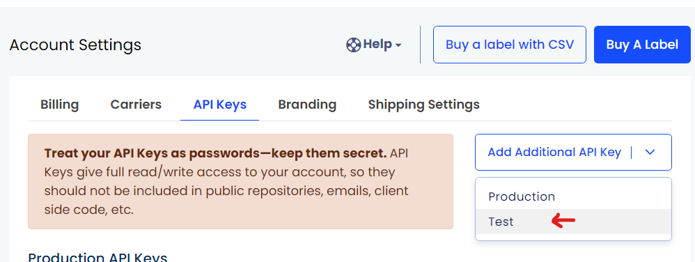
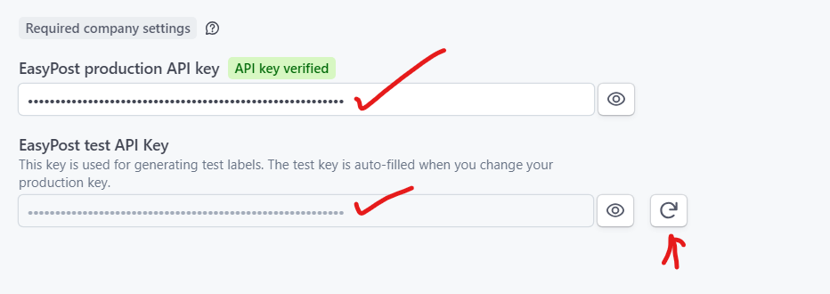

# Connecting Your EasyPost Account to Parcelcraft

To use Parcelcraft for shipping, you need to integrate it with an EasyPost account. EasyPost provides access to multiple shipping carriers and automates payments to the carriers, streamlining your shipping process. The free level of EasyPost allows up to 120,000 shipments per year. Follow the steps below to set up your EasyPost account and connect it to Parcelcraft.

## Create or Log In to Your EasyPost Account

- If you don't have an EasyPost account, [sign up for one here](https://www.easypost.com/signup?utm_source=Parcelcraft).
- If you already have an account, [log in to EasyPost](https://www.easypost.com/login).

## Obtain Your EasyPost Production API Key

1. Log in to your EasyPost account and navigate to the [EasyPost API Keys tab on the Account Settings page](https://www.easypost.com/account/settings?tab=api-keys).

   > **Note**: **If you DO NOT see an API keys tab in EasyPost**, you'll need to contact [EasyPost Support](https://support.easypost.com/hc/en-us/requests/new) to ask them to enable your account for API Keys 

2. In your EasyPost account confirm you have both production and test keys set up in your account.

   

3. If you are lacking a test key, click on *Add additional key** on your  [EasyPost API Keys tab on the Account Settings page](https://www.easypost.com/account/settings?tab=api-keys).

   

   > **IMPORTANT:** You **must have both a production and a test key** in EasyPost for Parcelcraft to have the ability to create test labels.

4. In the Production API Keys box, click on the **Copy** button to copy your PRODUCTION API key to your clipboard.

## Enter Your EasyPost API Key in Parcelcraft

1. Log in to your Stripe account and go to the [Parcelcraft Shipping Settings page](https://dashboard.stripe.com/settings/apps/com.productivity.parcelcraft).
2. On the **Main settings** tab, locate the EasyPost production API key field.
3. Paste the Production API key you copied from EasyPost into the provided box.  Even in Stripe Test mode, you must enter a **Production API** key into the Parcelcraft settings.

   

   > Note:  If you have both a test and production key in your EasyPost account, your EasyPost Test API key will be auto filled.  Click the refresh button next to your EasyPost Test API Key if you need to add or change your Test API Key in your EasyPost account.

That's it! You have now successfully connected your EasyPost account to Parcelcraft. At this point you will be able to enter your origin address and then you'll be able to create test labels.  

 > If you'd like a safe space to create test labels, use Stripe Test mode. It's impossible to create a production label when Stripe is in Test mode.  Stripe Test mode settings are completely isolated from live mode settings, so you may need to add your API key in both Stripe modes in your Parcelcraft settings.

To print real shipping labels, you'll also need to add your Billing Details in your EasyPost account.

## Access Your EasyPost Billing Settings

1. Once logged into the EasyPost dashboard, click on **Account Settings** in the left-hand sidebar.
2. Select the **Billing** tab.

## Set Up Your Payment Methods

1. Click the **Setup Wallet** button.
   - If you already have a payment method associated with your account, you can click **Add a Secondary Account** or **Add a Primary Account**.
   - Note: You can only have two payment methods added to your account at a time. If you need to add a different payment method, you must first delete one of the existing payment methods using the three-dot button on the right of the payment method.

2. Choose the option to **Add a Bank Account**.
   - Follow the prompts in the secure Plaid-supported portal to log in to your bank account using your online banking credentials.
   - Some banks may require additional authentication (SMS or phone call) using the number on file with your banking institution.
   - Once connected, your bank will be automatically verified, and you can initiate your first transfer of funds (3-5 days processing time once initiated).

## Understanding the EasyPost Wallet

The EasyPost Wallet allows you to pay for shipping labels. It's crucial to keep your Wallet sufficiently funded to prevent any disruptions in your shipping process due to failed payments.

### Funding Your Wallet

You can fund your EasyPost Wallet via two methods:

1. **ACH bank transfer**: No processing fee, but funds may take a few days to become available in your account.
2. **Credit Card**: Immediate funding, but incurs a 3.75% processing fee.

### Setting Up Automatic Recharges

After the initial deposit, you can set your Minimum Balance and Recharge Amount. When your Wallet balance falls below the Minimum Balance, it will automatically be recharged with the specified Recharge Amount.

For example, if you set your Minimum Balance to $500 and your Recharge Amount to $1,000, your Wallet will be topped up with $1,000 whenever the balance drops below $500.

### ACH vs. Credit Card: Which Is Better?

- **Credit Card**: Funds your account immediately, allowing you to start shipping right away. However, it incurs a 3.75% processing fee.
- **ACH bank transfer**: Has no processing fee, making it a cost-effective option for long-term use. However, you'll need to wait a few days for the funds to be available in your account.

> **Tip:** We recommend initially funding your account with a credit card to start shipping instantly. Then, set up ACH for long-term savings and stability.

Remember, you'll need to have sufficient funds in your EasyPost account before you can start generating shipping labels through Parcelcraft.

For more detailed information about EasyPost accounts, billing, and features, visit the [EasyPost support page](https://support.easypost.com/hc/en-us/categories/360003467012-Account-Billing).