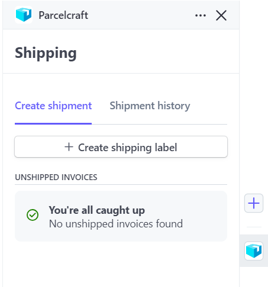
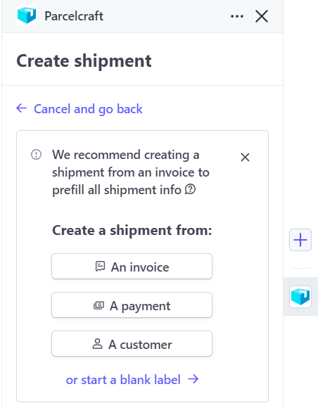

# Printing a Test Shipping Label

Now that you have linked your EasyPost account to Parcelcraft and set up your warehouse in the previous steps, you are ready to print a test label. This process will help you ensure that your integration is working correctly and that you can successfully generate and print shipping labels.

## Step 1: Access the Parcelcraft Dashboard

1. Log in to your Stripe account and navigate to the Home page.
2. Locate the Parcelcraft icon on the dashboard and click on it to open the Parcelcraft dashboard.

## Step 2: Create a New Shipping Label

1. In the Parcelcraft dashboard, click on the "+ Create shipping label" button to start the label creation process.

2. On the next screen, click on the "or start a blank label" link to manually enter the shipping details.

3. Fill out the necessary address information for the test label and click on the "Use address" button to proceed.

## Step 3: Print the Test Label

1. After entering the shipping details, locate the "..." button to the right of the "Buy label" button.
2. Click on the "..." button to reveal additional options.
3. Select "Print test label" from the dropdown menu.

When you click "Print test label," Parcelcraft will generate a test shipping label based on the settings you have configured on the "Printers & digital scale" tab of the Parcelcraft Settings page. By default, the test label will open in a new browser window, allowing you to print it or save it for your records.

> **Tip:** If the test label doesn't open or print as expected, double-check your printer settings and ensure that your printer is connected and functioning properly. You can also review the settings on the "Printers & digital scale" tab to make sure they are configured correctly for your setup.

By successfully printing a test shipping label, you can confirm that your EasyPost integration is working as intended and that you are ready to start processing real shipments through Parcelcraft.

If you encounter any issues or have questions during this process, don't hesitate to reach out to the Parcelcraft support team for assistance. They are available to help you troubleshoot any problems and ensure a smooth experience with the platform.
