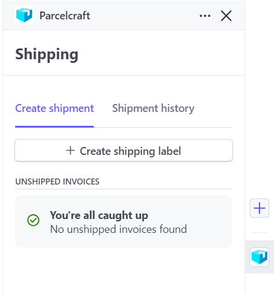
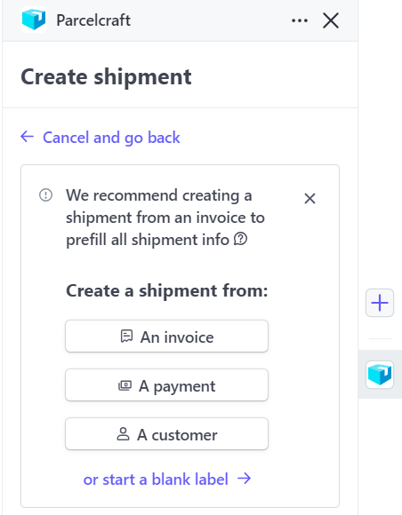
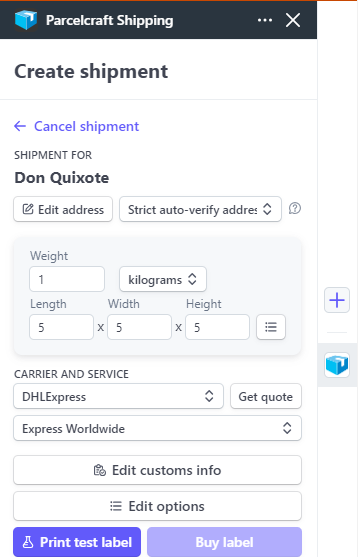
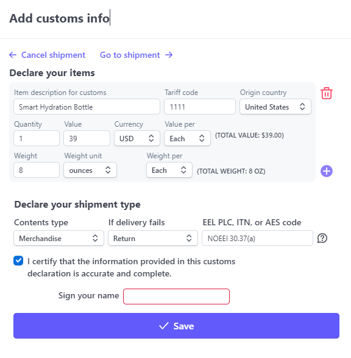

# Print International Test Label

In this tutorial, we will guide you through the process of manually creating an international shipping label using Parcelcraft. Typically, most of the information entered during this tutorial would be automatically populated from the invoice and defaults set up in the [Enable 1-Click Shipping](/enable-1-click-shipping) and [International Defaults](/international-shipping/international-settings) sections.

## Step 1: Access the Parcelcraft Dashboard

1. Log in to your Stripe account and navigate to the Home page.
2. Locate the Parcelcraft icon on the dashboard and click on it to open the Parcelcraft dashboard.

## Step 2: Start a New Shipping Label

1. In the Parcelcraft dashboard, click on the **+ Create shipping label** button to start the label creation process.

2. Click on the **or start a blank label** link to manually enter the shipping details.
3. In the address fields, enter an international address and click on the **Use address** button to proceed.

## Step 3: Enter Shipment Information

Fill in the weight, dimensions, and carrier information for your shipment. Make sure to select a carrier and service that supports international shipping.

## Step 4: Edit Customs Information

1. Click on the **Edit customs info** button to open the customs information dialog.
2. Fill out the required customs details, including:
   - Product descriptions
   - Tariff codes
   - Quantities
   - Values

> **Tip:** Please see the [Additional Resources](additional-resources.mdx) for links to official customs information.

3. Once you have completed filling out the customs information, click on the **Save** button to return to the **Create shipment** dialog.

## Step 5: Print the Test Label

1. Click on the **Print test label** button to generate a test shipping label and customs sheet.
2. By default, the test label will open in a new browser window or tab.
3. Review the label and customs sheet for accuracy.
4. Print the label and customs sheet or save them for your records.

> **Tip:** If the test label doesn't open or print as expected, double-check your printer settings and ensure that your printer is connected and functioning properly. You can also review the settings on the **Printers & digital scale** tab to make sure they are configured correctly for your setup.

5. Attach the printed customs sheet to your shipment, typically in a clear plastic pouch or envelope, as required by your shipping carrier.

If you encounter any issues or have questions during this process, don't hesitate to reach out to [support@parcelcraft.com](mailto:support@parcelcraft.com) for assistance. Our support team is available to help you troubleshoot any problems and ensure a smooth experience with the Parcelcraft platform.
