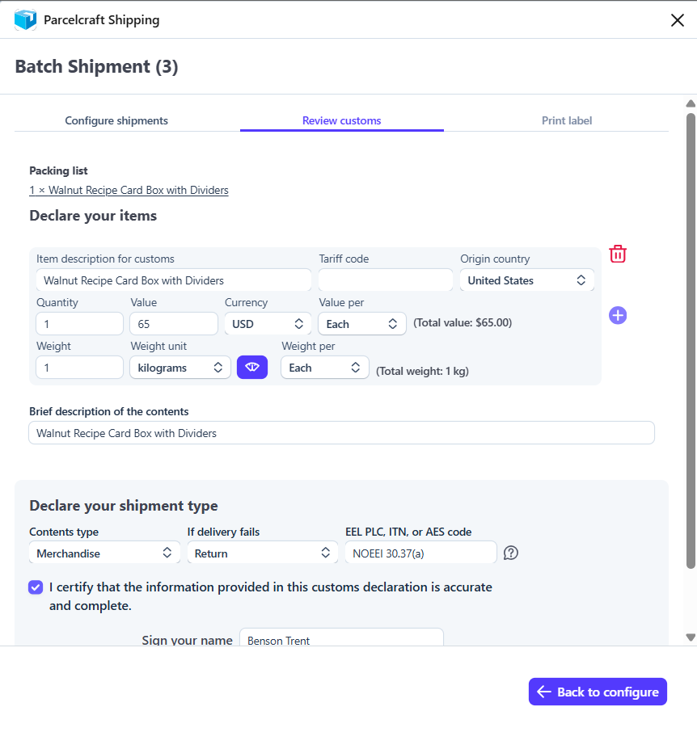

# Print an international test label

In this tutorial, we will guide you through manually creating an
international shipping label using Parcelcraft. Typically, most of the
information entered during this tutorial would be automatically populated
from the invoice and the defaults set up in the
[Enable 1-Click Shipping](/enable-1-click-shipping) and
[International Defaults](/international-shipping/international-settings)
sections.

## Step 1: Start a blank shipment

1. Open the [full-page app](/full-page-app) — in the Stripe dashboard's left
   sidebar, click **Apps**, then **Parcelcraft Shipping** — or open the
   Parcelcraft drawer from the app tray at the top right.
2. Click the **+ Create shipment** button. This opens the
   [Create shipment view](/full-page-app/create-shipment) with a blank
   shipment prefilled from your defaults.

## Step 2: Enter the shipment information

1. In the **Ship to** fields, enter an international address — any address
   outside your origin country.
2. Fill in the weight, dimensions, and carrier information for your
   shipment. The service dropdown automatically filters to services that
   support international delivery for the selected carrier.

## Step 3: Fill out the customs declaration

As soon as the destination country differs from your origin country, the
customs declaration appears automatically — there is no separate dialog to
open, and your entries are saved as you type. (In the shipment view it
appears inline below the shipment options; when shipping in bulk it gets its
own **Review customs** tab.)

Complete the declaration:

1. **Declare your items** — one entry per product in the package, prefilled
   from your international defaults and the order's packing list:
   - Item description for customs
   - Tariff code (HS code)
   - Origin country
   - Quantity, value, and currency (per item or total)
   - Weight (per item or total)
2. **Declare your shipment type** — the contents type (merchandise,
   documents, gift, and so on), what the carrier should do if delivery
   fails (return or abandon), and an EEL PFC, ITN, or AES code where
   required.
3. **Certify** — check the box confirming the declaration is accurate and
   sign your name. Your signature is remembered for future shipments.

> **Tip:** Please see the [Additional Resources](additional-resources.mdx)
> for links to official customs information.

You can't buy a label while the customs declaration is incomplete — the
button at the bottom of the view reads **Review customs** until every
required field is filled in.

## Step 4: Print the test label

1. Click **Print test** to generate a test shipping label and customs sheet.
2. The **Print label** tab opens; click **Print Label** to open them in a
   new browser tab.
3. Review the label and customs sheet for accuracy, then print them or save
   them for your records.

> **Tip:** If the test label doesn't open or print as expected, double-check
> your printer settings and ensure that your printer is connected and
> functioning properly. You can also review the settings on the **Printers &
> digital scale** tab to make sure they are configured correctly for your
> setup.

When shipping for real, attach the printed customs sheet to your shipment,
typically in a clear plastic pouch or envelope, as required by your shipping
carrier.

If you encounter any issues or have questions during this process, don't
hesitate to reach out to [support@parcelcraft.com](mailto:support@parcelcraft.com)
for assistance. Our support team is available to help you troubleshoot any
problems and ensure a smooth experience with the Parcelcraft platform.
