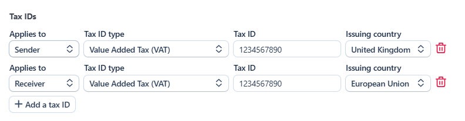

# Tax identifiers

Many countries require a tax identifier on the customs declaration — an IOSS
number for low-value goods into the EU, a VOEC number for Norway, an EORI or
UKIMS number for the UK, a GST number for Australia or Canada, and so on.
Carriers transmit these IDs to customs so your shipments clear without delays
or surprise fees, and a few carriers also use tax IDs for specific domestic
locales.

Parcelcraft attaches two kinds of tax IDs to a shipment:

- **Sender tax IDs** — your own registrations, saved once in the Parcelcraft
  settings and prefilled onto every shipment.
- **Receiver tax IDs** — your customer's registrations, prefilled
  automatically from the tax IDs saved on their Stripe customer record.

Both kinds can be reviewed, edited, added, or removed on each shipment before
you buy the label.

## Save your sender tax IDs

1. Open the **Main settings** tab of the
   [Parcelcraft Settings page](https://dashboard.stripe.com/settings/apps/com.productivity.parcelcraft)
   and scroll to the **Tax IDs** section.
2. Click **Add a tax id**, then choose the tax ID type, enter the number, and
   select the issuing country (the **European Union** appears as its own
   entry for EU-wide registrations like IOSS).
3. Click **Save**. Repeat for as many registrations as you hold — for
   example, an IOSS number for the EU and a UKIMS number for the UK.

Saved sender IDs are shared account-wide and appear on every new shipment.
You can update or delete them from the same list at any time.

## Receiver tax IDs come from Stripe

If the customer on an order has tax IDs saved on their
[Stripe customer record](https://docs.stripe.com/billing/customer/tax-ids),
Parcelcraft copies them onto the shipment as receiver tax IDs, translating
each Stripe tax ID type to the closest carrier equivalent — an EU OSS VAT
number becomes an IOSS identifier, a Canadian GST/HST number becomes a GST
identifier, and so on. There's nothing to configure; keeping your customers'
tax IDs current in Stripe is enough.

## Review tax IDs on a shipment

On any shipment, expand **Show more options** in the
[shipment options](/full-page-app/shipment-options) section — the **Tax IDs**
list sits below the option columns:

Each row shows who the ID applies to (**Sender** or **Receiver**), the tax ID
type, the number itself, and the issuing country. Edit any field in place,
remove a row with the trash icon, or click **+ Add a tax ID** to add one just
for this shipment — one-off additions don't change your saved settings, and
per-shipment edits don't either.

A couple of rules to know:

- **Incomplete rows are left off the label.** A tax ID needs a type, a
  number, and an issuing country; if any of the three is missing, the row is
  skipped rather than blocking your purchase.
- **The type list follows the carrier.** The tax ID type dropdown only offers
  types the selected carrier accepts. A prefilled ID whose type the carrier
  doesn't support stays visible so you can see what's on the shipment, with a
  note that the carrier may ignore it.

## Which tax ID types each carrier accepts

| Carrier | Tax ID types |
| --- | --- |
| USPS | VAT, IOSS |
| UPS | VAT, IOSS, VOEC, HMRC |
| FedEx | VAT, IOSS, GST, EORI, HMRC, UKIMS, EIN, SSN, State Tax ID |
| DHL Express | VAT, SDT, EORI, EIN, SSN, Federal Tax ID, State Tax ID, FTZ, CNP, DUN, and deferment accounts (DAN, TAN, DTF) |

> **Note:** DHL Express accepts IOSS numbers under the **GB VAT (foreign)
> registration (SDT)** type, so pick SDT when sending an IOSS number on a
> DHL Express shipment.

For other carriers — and when quoting all carriers — the dropdown offers the
full list of types, and the carrier uses the ones it understands.
